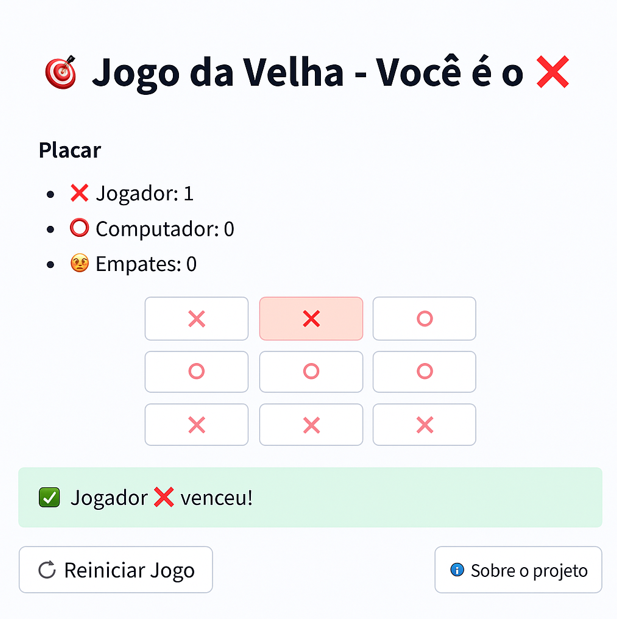

# 🎯 Jogo da Velha com IA Boba em Streamlit

<p align="center">
  
</p>

## 🎮 Teste agora mesmo:
👉 [jogo-da-velha.streamlit.app](https://jogo-da-velha.streamlit.app)

Este é um jogo da velha interativo com interface web feito em Python com [Streamlit](https://streamlit.io).  
Você joga como ❌ e o computador joga como ⭕

## 🧠 Funcionalidades

- Interface visual com botões clicáveis  
- Emojis para representar os jogadores  
- Placar acumulado  
- IA boba que tenta vencer, bloquear ou joga aleatoriamente  
- Layout centralizado e responsivo  
- Pronto para rodar localmente ou publicar no Streamlit Cloud

## ▶️ Como executar

```bash
pip install -r requirements.txt
streamlit run jogo_da_velha.py

```

## 📦 Requisitos

- Python 3.7+
- streamlit >= 1.25

---

Desenvolvido por [Stephanie Jollo]
